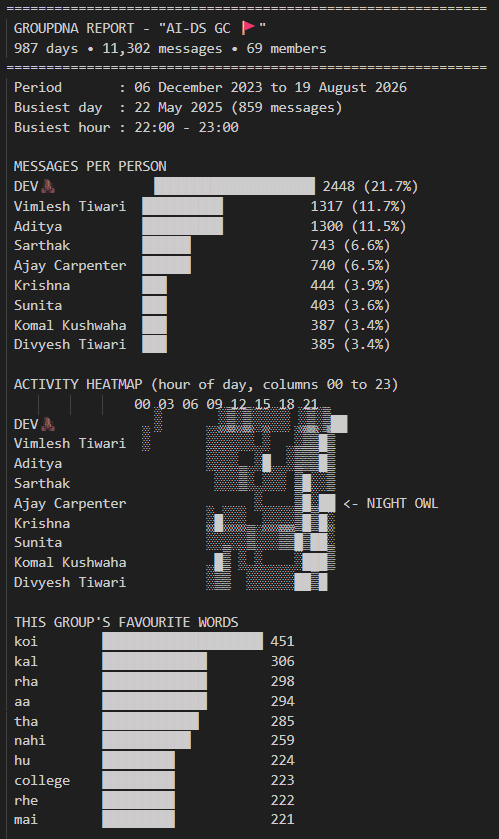
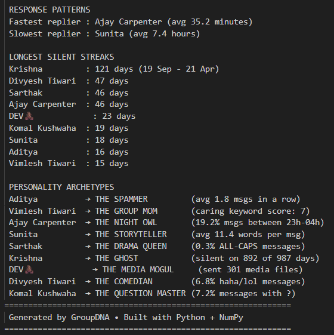

# GroupDNA - WhatsApp Chat Analyzer

**A raw, honest look into my college group chat.**

This Python project analyzes a WhatsApp group chat export and generates a text-based dashboard with various statistics, including daily activity, longest silent streaks, top words, and automatically assigned personality archetypes for each participant.

## Final Output Dashboard 📸
Here is a snapshot of the final output generated completely using Python logic, directly in the terminal:

## Build Log & Process 🛠️

### What I Allowed Myself to Use:
- Python core fundamentals (variables, dictionaries, sets, lists, loops, conditionals)
- `datetime` module (for time gap calculation)
- `NumPy` (specifically for a 2D matrix for the activity heatmap)
- Basic string parsing methods (split, strip, replace)

### What Was Strictly Forbidden:
- ❌ `pandas` (no DataFrame cheat codes here!)
- ❌ Data visualization libraries like `matplotlib`, `seaborn`, or `plotly` (the heatmap is 100% text-based!)
- ❌ External chat parsing libraries
- ❌ Advanced regex (`re` module)

## The Seven-Day Build Log

* **Day 1**: Built the basic text parser. Handled system messages, media omitted placeholders, and deleted messages. Even tackled multi-line messages!
* **Day 2**: Processed overall stats. Counted messages per person and total group active days.
* **Day 3**: Calculated word frequency, stripped punctuation, and added a custom stop-words list to filter out boring conjunctions.
* **Day 4**: Built an Nx24 `NumPy` matrix and rendered a pretty console heatmap with shading blocks.
* **Day 5**: Used `datetime` to parse timestamps, calculated response times, and found the longest silent ghosting streaks.
* **Day 6**: Wrote custom detection rules for 9 distinct archetypes and built an exclusive assignment system (the person with the highest normalized score gets the archetype).
* **Day 7**: Polished the final output using f-strings and box-drawing characters for the perfect terminal aesthetic.

## AI Declaration & Plagiarism Statement 🤖
As per the project guidelines (Page 24 Anti-plagiarism check), I am formally declaring the use of AI assistance (Google Gemini) in the development of this project. Specifically, AI was used to assist with:
- Debugging the `NumPy` heatmap matrix initialization and slicing logic.
- Refining the conditional loops for tracking the Longest Silent Streaks without using `pandas`.
All other logic, file parsing, and archetype structuring was implemented manually.

## How to Run the Code

1. Make sure you have Python 3 installed.
2. Install NumPy: `pip install numpy`
3. Export your WhatsApp chat (without media) as a `.txt` file.
4. Place the `.txt` file in the same directory as the notebook and update the file path in the code.
5. Run all cells in `GroupDNA_Sarthak_DS17725.ipynb` top-to-bottom.
6. Check out your group's dashboard in the final cell output!
